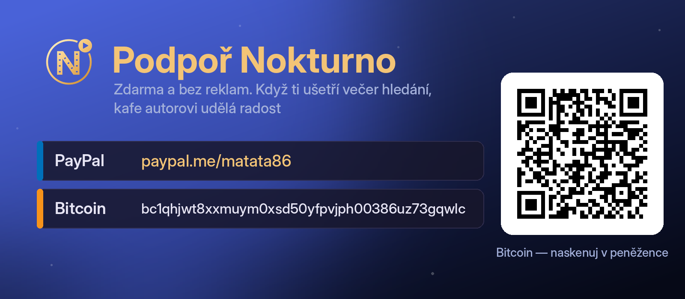

# nokturno-core

[](https://ko-fi.com/matata86) [](https://paypal.me/matata86) [](#podpora)

Sdílené jádro Nokturna. Hledání a streamy ve WebShare, Sosáči, HellSpy, Sledujteto, FastShare, CZtoru, Luně
a na trackerech přes Prowlarr — bez vazby na hostitele.

Čistý Python 3, jen standardní knihovna. Žádný import z `xbmc*` ani
z `homeassistant`, což hlídá test.

> **Patří k sobě:** nad tímhle jádrem stojí [**Nokturno pro Kodi**](https://github.com/matata86/plugin.video.nokturno), [**Nokturno pro Home Assistant**](https://github.com/matata86/nokturno-ha) a [**Nokturno pro Stremio**](https://github.com/matata86/nokturno-stremio) (i Nuvio) — tři samostatné doplňky nad stejnými zdroji.

## Kdo z toho žije

| Konzument | Bere | Poznámka |
|---|---|---|
| [plugin.video.nokturno](https://github.com/matata86/plugin.video.nokturno) | `lib/` + `engine.py` (ploše) | doplněk pro Kodi; `default.py` nad jádrem staví `KodiEngine` |
| [nokturno-ha](https://github.com/matata86/nokturno-ha) | `lib/` + `engine.py` | integrace pro Home Assistant |
| [nokturno-stremio](https://github.com/matata86/nokturno-stremio) | vše | doplněk pro Stremio |

## Pravidlo

**Jádro se edituje jen tady.** U konzumentů je vysypaná kopie, která se při
příštím rozeslání přepíše. Oprava udělaná u nich se tiše ztratí.

```bash
python3 tools/sync_core.py --check          # co by se změnilo, nezapisuje
python3 tools/sync_core.py --check --diff   # totéž i s obsahem změn
python3 tools/sync_core.py                  # rozešle všem
python3 tools/sync_core.py kodi             # jen jednomu
```

Doplněk pro Kodi načítá `resources/lib` ploše přes `sys.path`, ne jako balíček,
takže se mu relativní importy při zápisu zplošťují. Ostatní berou soubory beze změny.

## Testy

```bash
python3 -m unittest discover -s tests -v
```

Nesahají na síť. Ověřují tvar jádra a to, co na něm konzumenti vyžadují jmenovitě —
tedy přesně věci, které se při rozesílání dají tiše rozbít.

## Struktura

```
nokturno_core/
├── engine.py       jádro: hledání, sloučení zdrojů, streamy, řazení
├── lib/
│   ├── const.py    klíče nastavení a výchozí hodnoty
│   ├── luna_api.py cinemeta_api.py tmdb_api.py     katalogy a metadata
│   ├── webshare_api.py sosac_direct.py hellspy_api.py   zdroje streamů
│   ├── prowlarr.py qbittorrent.py                  torrenty
│   ├── streams.py mediainfo.py                     rozbor a řazení streamů
│   ├── crash.py                                    hlášení o pádech (otisk, mazání citlivých údajů, fronta)
│   ├── trend_api.py dash_api.py                    žebříček, katalogy, podobné tituly a TV program z dashboardu
│   ├── sync.py syncbox.py                          synchronizace přes HA / přes slepý relay
│   └── store.py stats.py trakt_api.py enrich.py sosac_api.py
└── ...
```

## Vznik

Vyčleněno 2026-09-12 z integrace pro Home Assistant, kde `engine.py` už bylo bez
jakékoli vazby na hostitele. Do té doby existovala knihovna jako dvě ruční kopie,
které se stihly rozejít v šesti souborech. Sloučení vzalo z každé větve to, co
měla navíc: cachování a řazení z větve pro Kodi, ukazatel průběhu v `enrich`
z větve pro Home Assistant.

---

## Podpora

[](https://ko-fi.com/matata86)

- **Ko-fi:** https://ko-fi.com/matata86
- **PayPal:** https://paypal.me/matata86
- **Bitcoin:** `bc1qhjwt8xxmuym0xsd50yfpvjph00386uz73gqwlc`

## Výkon (od 2026-09-14)

- `Engine.streams()` se pěti zdrojů (Luna/Sosáč, WebShare, HellSpy, Sledujteto, FastShare) ptá
  **souběžně** (`ThreadPoolExecutor`), pořadí výsledků drží kvůli párování v `_merge_direct`.
  Líné klienty (`ws`, `hs`, `st`, `fs`, `sosac`) zakládá před spuštěním vláken.
- `original_titles()` se za jeden výpis počítá jednou (paměť v enginu, 5 min; po výpadku
  Wikidat jen 30 s, aby další výpis zkusil znovu) — dřív pětkrát, při výpadku Wikidat až 100 s navíc.
- WebShare: selhání loginu už nezamkne zdroj do restartu (`WS_RETRY_S = 60`); re-login jen když
  server odmítl (`WebshareApiError`), ne při síťové chybě.
- TMDB: `external_ids` + `images` jedním dotazem (`append_to_response`) — stránka katalogu 1 + 20
  požadavků místo 1 + 40; sezóny seriálu souběžně.
- Sosáč: hledání seriálů nad indexem (`sosac:tvindex`, jednou denně) místo 27 souborů a normalizace
  tisíců názvů při každém dotazu.
- `enrich`: jeden sdílený executor na proces (dřív nový na každé hledání s `shutdown(wait=False)` —
  desítky visících vláken) a dedup rozpracovaných dotazů na tentýž titul.
- Úložiště: značka `.nokturno-rev` se čte nejvýš jednou za minutu (`REV_TTL`); hledání Luny má jednu
  cache (v `LunaApi`), ne dvě.

## Údržba (2026-09-14)

- Jedna `human_size` a jedna `fold` ve `streams.py` (dřív 4× a 2× s různým zaokrouhlením/chováním);
  ostatní moduly je jen re-exportují, klienti importují dál z původních míst.
- Cinemeta jen přes `CinemetaApi` (`Engine.search_catalog` měl třetího vlastního klienta).
- User-Agent už netvrdí, že je Kodi nebo Home Assistant — `Nokturno (+github)`; `stats.send()`
  dostává `agent` od hostitele.
- Pryč diagnostické lešení Sledujteto (`last_keys`, `last_sample`, INFO logování), `HISTORY_MAX`,
  `_logged` v qBittorrentu, prázdná větev v `sosac_direct.streams`; `urllib.error` importovaný explicitně.

## Diagnostika Luny (`lib/luna_api.py`, 2026-09-18)

Luna se instaluje mimo doplněk a „nefunguje mi to" o ní chodí častěji než o všech
ostatních zdrojích dohromady. `diagnose(base, token)` projde celý řetěz a vrátí
kód příčiny (`unreachable`, `not_luna`, `no_token`, `bad_token`, `no_streams`, …),
který si každá větev přeloží do vlastní hlášky; `discover()` najde Lunu v podsíti
(TCP klepnutí na 7126 + manifest, celá `/24` za ~1,6 s); `normalize_base_url()`
spolkne holou IP i celou adresu ze `/setup` včetně tokenu.

Proč je to potřeba: **manifest Luna vydá i pro neplatný token** (jen s výchozím
nastavením), takže kontrola „přišel manifest = zdroj funguje" byla falešně zelená.
Ověřit token jde jedině dotazem na streamy, a to na víc titulech — hlavní zdroj
Luny nemá všechno.

## CZtor (`lib/cztor_api.py`, 2026-09-19)

Sedmý zdroj: katalog na předplatné (cztor.com, soubory na giganthost.com). API je to,
které používá jejich doplněk pro Kodi (`plugin.video.cztor` 0.1.27), ověřené naživo
na testovacím účtu. Bez tokenu vrací všechno 401.

- **Párování PINem, žádné heslo.** `start_pin()` → PIN, uživatel ho potvrdí na
  `cztor.com/activate`, `poll_pin()` uloží tokeny do úložiště jádra (`cztor_session`,
  spolu s `device_id`). Hostitel jen kreslí PIN a ptá se (Kodi `DialogProgress`,
  HA krok `cztor` v nastavení integrace).
- **Obnovovací token se použitím mění** (starý pak vrací 401). Obnova běží pod zámkem
  a před ní se relace čte znovu z disku — plugin a služba Kodi sdílejí jeden soubor
  a kdo přijde s už použitým tokenem, vezme ten nový místo zrušení párování.
  Zamítnutá obnova (401/403) párování zapomene → `NotPaired`.
- **Párování titulu přes id.** Hledání je volný fulltext („Matrix" vrátí i Počátek),
  položky ale nesou `ids.imdb/tmdb/csfd`. Bez IMDb id (české seriály mívají jen ČSFD)
  rozhoduje název: přesná shoda s rokem ±1, nebo podobnost ≥ 0,85 s přesným rokem —
  CZtor ukazuje slovenské názvy („Okresný prebor"). Seriály rozdělené po sériích
  („Zrádci - Série 1") nesou `_split_season`.
- **Do seznamu streamů jde jen odkaz** `cz:<m|e>:<id titulu/dílu>:<id streamu>`;
  `playback_url` platí chvíli, takže se bere čerstvá v `resolve()` (seznam streamů
  s adresami cache 5 min, pak znovu). Adresa hraje bez hlaviček a není vázaná na IP.
- **Údaje o souboru z API** (`audio_tracks`, `subtitle_tracks`, rozlišení, velikost)
  jdou do `_media`/`_tracks` ve tvaru `mediainfo.probe()`, takže `_fill_audio` hlavičku
  nečte a kvalitu určuje skutečné rozlišení, ne název („1080p.UHD.BluRay" není 4K).
- V enginu přepínač `cz_enabled` (`CONF_CZ_ENABLED`), zdroj běží souběžně s ostatními,
  `_merge_direct` ho k Luně nepřibaluje. Stav spárování (`sources()["cztor"]`) se zjistí
  při založení enginu — HA čte `sources()` ze smyčky událostí, kam čtení souboru nepatří.
- Stremio kopii jádra má, CZtor ale nenabízí: každé nastavení doplňku by potřebovalo
  vlastní párování a server by musel držet a obnovovat tokeny cizích účtů.

Testy `tests/test_cztor_api.py` (21) nad odpověďmi zachycenými z živého API.

## Synchronizace bez Home Assistanta (`lib/syncbox.py`, 2026-09-17)

Dnešní `sync.py` umí vyměňovat stav mezi více Kodi, ale potřebuje k tomu HA jako
střed (`POST /api/nokturno/sync`). `syncbox.py` dává tutéž funkci i domácnostem
bez HA — střed dělá dashboard, ale **jen jako slepý relay**: ukládá neprůhledné
bloby, které nedokáže přečíst. Zadání uživatele (2026-09-17): anonymní, a nastavení
včetně účtů se synchronizuje taky, ale musí jít nezvolit.

> **Stav k 2026-09-17:** klient (`lib/syncbox.py`, 27 testů) i server
> (`Dashboard/backend/syncrelay.py`, 19 testů) hotové a ověřené proti sobě —
> stav dojde na druhé zařízení a v uloženém blobu se nedá najít název titulu ani
> jeho id. **Chybí UI v doplňku** (párování, kategorie nastavení, napojení na
> službu) a **okruhy `settings`/`accounts`** — ty jsou zatím jen návrh níž.
> Vyvíjí se ve větvi `sync` (`Nokturno/sync-dev/`), nevydává se.

**Protokol slévání se nemění.** `collect_changes()` / `apply_changes()` zůstávají
jak jsou — slévání je last-write-wins podle `ts`, tedy komutativní, takže
nezáleží, v jakém pořadí a od koho záznamy přijdou. To je celý důvod, proč relay
nemusí nic chápat: každý klient si slije cizí stavy sám u sebe.

### Skupina a kód

Master vygeneruje **kód**: 16 znaků Crockford Base32 (bez `I`, `L`, `O`, `U`, ať
se nepřepisuje špatně z TV), zobrazený jako `NKT-XXXX-XXXX-XXXX-XXXX` — 80 bitů
entropie. Kód je zároveň klíč; **na server nejde nikdy**, ani v hashované podobě
jinak než takto:

```python
root     = hashlib.pbkdf2_hmac("sha256", kod.encode(), b"nokturno-sync-v1", 200_000)
group_id = hmac.new(root, b"gid", hashlib.sha256).hexdigest()[:32]   # jen tohle vidí server
enc_key  = hmac.new(root, b"enc", hashlib.sha256).digest()
mac_key  = hmac.new(root, b"mac", hashlib.sha256).digest()
```

`group_id` je z kódu odvozené jednosměrně, takže slouží zároveň jako adresa
skupiny i jako bearer token relaye: kdo ho zná, smí do skupiny psát a číst z ní,
ale bez kódu nic nedešifruje. **Proto nesmí být v URL** (Tailscale i nginx logují
cesty) — patří do hlavičky `X-Nokturno-Group`.

### Šifrování jen ze stdlib

Doplněk pro Kodi má dodnes jedinou závislost (`xbmc.python`) a stálo by to za to
udržet — `script.module.pycryptodome` by u stovky už nasazených instalací
znamenal, že si aktualizaci nestáhne každý, kdo má vypnuté oficiální repo.
Stdlib stačí: `hashlib`, `hmac`, `os.urandom`. Nevymýšlí se šifra, skládají se
standardní primitiva (SHA-256 v counter módu jako proudová šifra +
encrypt-then-MAC):

```
blob   = nonce(16 B) || ciphertext || tag(32 B)
proud  = SHA-256(enc_key || nonce || counter_be64)   pro counter = 0, 1, 2, …
ciphertext = gzip(json) XOR proud
tag    = HMAC-SHA256(mac_key, nonce || ciphertext)
```

Tag se ověřuje `hmac.compare_digest` **před** dešifrováním; neplatný blob se
tiše zahodí. Naměřeno na plném stavu (5000 záznamů `watched`): 511 kB JSON →
gzip 13 kB → celé zabalení **8 ms**. Bez komprese by to bylo 102 ms a 511 kB, takže
gzip před šifrováním není optimalizace, ale součást návrhu.

### Celý stav místo delt

Protože komprimovaný stav je jednotky až desítky kB, **odpadá delta protokol**:
každé zařízení nahraje celý svůj pohled (`collect_changes(store, 0)`) a relay
drží jeden přepisovaný řádek na zařízení. Nová instalace tím dostane všechno,
odpadá fronta i úklid delt a ztracený blob nic nerozbije. Nahrává se jen při
změně otisku (klient si pamatuje hash posledního odeslaného blobu).

**Pozor na `items`** — snímky titulů jsou v celém stavu dominantní (2000 položek
s popisem a obrázky je řádově stovky kB i po gzipu). Do blobu patří jen snímky
k položkám v Mém seznamu a rozkoukaným, zbytek si příjemce dohledá sám —
`recover_snapshot()` (hubený snímek, od Kodi `5.2.7~beta11`) na to už existuje.
Reálnou velikost je potřeba změřit na skutečném profilu, ne odhadovat.

### Okruhy (co se synchronizuje)

Pět nezávislých okruhů, každý zapínatelný na každém zařízení zvlášť; posílá se
i přijímá jen to, co je zapnuté:

| Okruh | Obsah | Výchozí |
|-------|-------|---------|
| `watched` | zhlédnuto a rozkoukanost (`watched.json`) | zap |
| `favourites` | Můj seznam přes deník `favlog` | zap |
| `history` | historie hledání (`histlog`) | zap |
| `settings` | nastavení doplňku bez hesel | **vyp** |
| `accounts` | přihlášení ke zdrojům (WebShare, HellSpy, Sledujteto, FastShare, Sosáč, úložiště) | **vyp** |

Master smí do skupiny zapsat **doporučené** okruhy (šifrovaný konfigurační blob),
které si nový člen předvyplní. Vynutit je nemůže a ani nemá — server do obsahu
nevidí, takže jediná vynucovací vrstva je klient sám.

`settings`/`accounts` se serializují podle schématu, které už umí
`remote_setup.remote_setup_schema()` (čte `settings.xml` po skupinách, zná typ
`password`). Nutný je **explicitní seznam nastavení vázaných na zařízení**, která
se nesynchronizují nikdy — složka pro stahování, jazyk rozhraní, adresa lokální
Luny, `stats_enabled`, `crash_reports` a samotné nastavení synchronizace. Bez
takového seznamu by sdílení nastavení rozbilo každý box, který má něco svého.

### Co plyne z toho, že kód je klíč

- **Schvalování masterem nechrání data.** Kdo má kód, dešifruje obsah bez ohledu
  na to, jestli ho master „pustil dovnitř". Skutečná ochrana je jediná: kód platí
  krátce (server přijme nové `device_id` do skupiny jen v okně po založení nebo
  po výslovném otevření masterem — to je metadata, ta server vidět smí) a v UI
  se ukazuje jen, dokud se opisuje.
- **Odebrání zařízení = nový kód.** Jinak to v end-to-end světě nejde; ostatní
  se musí spárovat znovu. V UI to musí být napsané, ne objevené.
- **Účty v okruhu `accounts` jsou chráněné jen kódem.** Zapnutí okruhu musí být
  potvrzené textem, který to říká nahlas.
- **Ztracený kód = ztracená skupina.** Server neumí obnovu, protože nemá co obnovit.

### Sloučení stavu — na co si dát pozor

- **Rozkoukanost je konfliktní.** Dva lidé na dvou TV u téhož seriálu si LWW
  navzájem přepíšou pozici. Minimum: dokoukaný titul se nikdy nevrátí na
  rozkoukaný. Ke zvážení „vyhrává větší pozice" místo „vyhrává novější zápis".
- **Rozbité hodiny.** Android box po výpadku napíše `ts` z budoucnosti a LWW ten
  záznam zafixuje napořád. Relay čas nevidí (blob je šifrovaný), takže clamp musí
  dělat příjemce při `apply_changes` — odmítnout `ts` výrazně nad vlastním časem.
- **Trim není smazání.** `WATCHED_MAX` ořízne nejstarší záznamy; oříznutí se
  nesmí projevit jako změna k odeslání, jinak by se stav postupně vyprazdňoval
  napříč skupinou.

### Anonymita

Relay ukládá `group_id`, `device_id` (náhodné, generované klientem), pořadí
revize, čas a blob. **Žádnou vazbu na `install_id` ze statistik** — jinak by šlo
spárovat anonymní hlášení s konkrétní domácností a celá anonymita statistik by
padla. Zařízení, které se dlouho neozve, se maže i s blobem.
